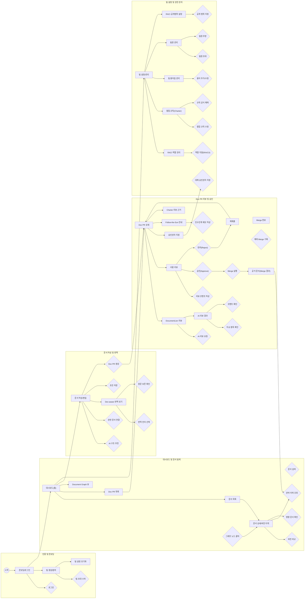

```mermaid
flowchart LR

  subgraph s1 ["인증 및 온보딩"]
    n1(("시작"))
    n2["온보딩/로그인"]
    n3["팀 생성/참여"]
    n4["팀 설정 초기화"]
    n5{"로그인"}
    n6{"팀 초대 수락"}
  end

  subgraph s2 ["대시보드 및 문서 탐색"]
    n7["대시보드(홈)"]
    n8["문서 목록"]
    n9["Doc PR 목록"]
    n10["Document Graph 뷰"]
    n11{"문서 검색"}
    n12{"영향 문서 확인"}
    n13{"그래프 노드 클릭"}
    n45["문서 상세/버전 이력"]
    n46{"버전 비교"}
    n47{"관여 이력 조회"}
  end

  subgraph s3 ["문서 작성 및 번역"]
    n14["문서 작성/편집"]
    n15{"AI 구조 추천"}
    n16{"관련 문서 연결"}
    n18{"초안 저장"}
    n19{"Doc PR 생성"}
    n48["Dev-aware 번역 보기"]
    n49{"번역 언어 선택"}
    n50{"원문 보존 확인"}
  end

  subgraph s4 ["Doc PR 리뷰 및 승인"]
    n22["Doc PR 상세"]
    n23["DocumentLion 리뷰"]
    n24["사람 리뷰"]
    n25["승인권자 지정"]
    n26["재제출"]
    n27["Merge 완료"]
    n28{"AI 리뷰 요청"}
    n29{"리뷰 코멘트 작성"}
    n30{"승인(Approve)"}
    n31{"반려(Reject)"}
    n32{"Merge 실행"}
    n33{"예외 Merge 기록"}
    n51["AI 리뷰 결과"]
    n52{"이슈 항목 확인"}
    n53{"코멘트 확인"}
    n54["Follow-the-Sun 안내"]
    n55{"인수인계 메모 작성"}
    n56["Charter 리뷰 근거"]
    n57["공식 문서(Merge 결과)"]
  end

  subgraph s5 ["팀 설정 및 권한 관리"]
    n35["팀 설정/관리"]
    n36["RACI 역할 관리"]
    n37["협업 규칙(Charter)"]
    n38["팀 용어집 관리"]
    n39["팀원 관리"]
    n40{"역할 지정(R/A/C/I)"}
    n41{"협업 규칙 수정"}
    n42{"규칙 공식 채택"}
    n43{"용어 추가/수정"}
    n44{"대체 승인권자 지정"}
    n58["RACI 공개범위 설정"]
    n59{"공개 범위 지정"}
    n60{"팀원 초대"}
    n61{"팀원 추방"}
  end

  n1 --> n2
  n2 --> n5
  n2 --> n3
  n3 --> n6
  n3 --> n4
  n2 --> n7
  n7 --> n8
  n7 --> n9
  n7 --> n10
  n8 --> n45
  n7 --> n14
  n14 --> n15
  n14 --> n16
  n14 --> n48
  n14 --> n18
  n14 --> n19
  n48 --> n49
  n48 --> n50
  n19 --> n22
  n9 --> n22
  n22 --> n23
  n22 --> n24
  n22 --> n25
  n22 --> n54
  n23 --> n28
  n24 --> n29
  n24 --> n30
  n24 --> n31
  n31 --> n26
  n26 --> n22
  n30 --> n32
  n32 --> n57
  n25 --> n44
  n7 --> n35
  n35 --> n36
  n35 --> n37
  n35 --> n38
  n35 --> n39
  n36 --> n40
  n37 --> n41
  n37 --> n42
  n38 --> n43
  n45 --> n46
  n45 --> n47
  n45 --> n12
  n23 --> n51
  n51 --> n52
  n51 --> n53
  n22 --> n56
  n54 --> n55
  n57 --> n47
  n35 --> n58
  n58 --> n59
  n39 --> n60
  n39 --> n61
  n13 --> n45
```
